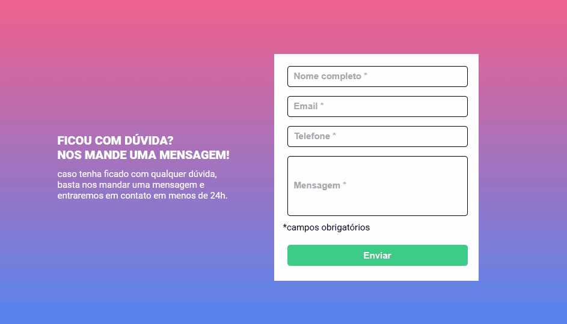

# Formulário para Contato

Exercício proposto de HTML + CSS + JS intermediário para criação de uma seção com preenchimento de formulário para contato.

## Tabela de Conteúdo

- [Desafio](#desafio)
- [Screenshot](#screenshot)
- [Ferramentas](#ferramentas)
- [Autora](#autora)

## Desafio

Para este projeto, o desafio foi criar formulário com o intuito de marcar os campos vazios em vermelho e os campos preenchidos em verde, desse modo o usuário saberá quais campos são obrigatórios e quais campos faltam preencher. (Nesse caso, todos os inputs são obrigatórios)

## Screenshot

## Ferramentas

- HTML com semântica
- Estilização com CSS
- JavaScript (DOM e funções)

## Autora

- LinkedIn - [Camila Katayama](https://www.linkedin.com/in/camila-katayama-ab1a42153/)
- GitHub - [@camilakataa](https://github.com/camilakataa)

